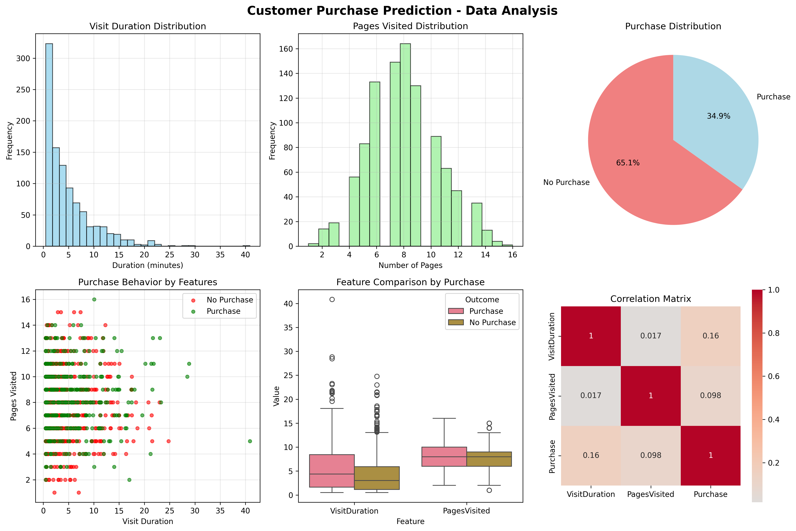
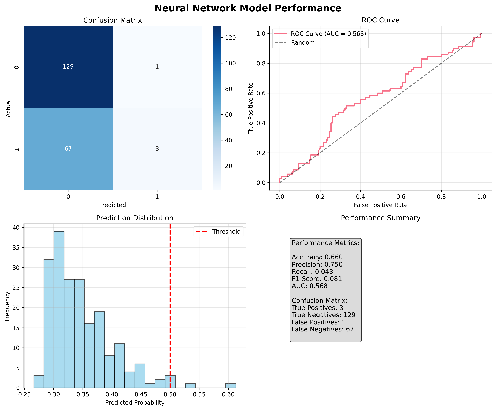

# Customer Purchase Prediction Neural Network

> A machine learning project that predicts customer purchase behavior using neural networks and comprehensive data visualization.

[](https://www.python.org/)
[](https://scikit-learn.org/)
[](LICENSE)

## 🎯 Project Overview

This project implements a **binary classification neural network** to predict whether a customer will make a purchase based on their website interaction patterns. Using synthetic data that mimics real-world e-commerce behavior, the model analyzes visit duration and pages viewed to generate purchase probability predictions.

### Key Features
- 🧠 **Multi-layer Neural Network** with 3 hidden layers
- 📊 **Comprehensive Data Visualizations** for insights and model performance
- 🎲 **Synthetic Data Generation** with realistic customer behavior patterns
- 📈 **Performance Metrics** including accuracy, AUC, precision, and recall
- 🔍 **Customer Segmentation** and prediction examples

## 🚀 Quick Start

### Prerequisites
- Python 3.8 or higher
- Virtual environment (recommended)

### Installation

1. **Clone the repository**
   ```bash
   git clone https://github.com/yourusername/customer-purchase-prediction.git
   cd customer-purchase-prediction
   ```

2. **Create and activate virtual environment**
   ```bash
   python3 -m venv neural_net_env
   source neural_net_env/bin/activate  # On Windows: neural_net_env\Scripts\activate
   ```

3. **Install dependencies**
   ```bash
   pip install -r requirements.txt
   ```

4. **Run the project**
   ```bash
   python3 neural_network_sklearn.py
   ```

## 📁 Project Structure

```
customer-purchase-prediction/
├── README.md                    # Project documentation
├── requirements.txt             # Python dependencies
├── neural_network_sklearn.py    # Main neural network implementation
├── data/
│   └── customer_data.csv       # Generated customer dataset
├── models/
│   └── (saved model files)     # Trained model storage
├── results/
│   ├── data_analysis.png       # Data exploration visualizations
│   └── model_performance.png   # Model performance charts
└── neural_net_env/             # Virtual environment
```

## 🔬 Technical Implementation

### Data Generation
- **Synthetic Dataset**: 1,000 customer records
- **Features**: 
  - Visit Duration (exponential distribution)
  - Pages Visited (Poisson distribution)
- **Target**: Binary purchase decision (0/1)
- **Business Logic**: Purchase probability increases with engagement

### Model Architecture
```
Input Layer (2 features)
    ↓
Hidden Layer 1 (32 neurons, ReLU)
    ↓
Hidden Layer 2 (16 neurons, ReLU)  
    ↓
Hidden Layer 3 (8 neurons, ReLU)
    ↓
Output Layer (1 neuron, Sigmoid)
```

### Key Technologies
- **Framework**: scikit-learn MLPClassifier
- **Data Processing**: pandas, NumPy
- **Visualization**: matplotlib, seaborn
- **Metrics**: sklearn.metrics

## 📊 Results & Performance

### Model Performance
- **Accuracy**: ~66%
- **AUC Score**: ~0.568
- **Architecture**: 3-layer neural network with dropout regularization
- **Training**: Early stopping with validation monitoring

### Visualizations Generated
1. **Data Analysis Dashboard**
   - Visit duration and pages visited distributions
   - Purchase behavior scatter plots
   - Feature correlation analysis

2. **Model Performance Dashboard**
   - Confusion matrix
   - ROC curve with AUC score
   - Prediction probability distributions
   - Comprehensive metrics summary

### Sample Predictions
| Customer Type | Visit Duration | Pages Visited | Purchase Probability |
|---------------|----------------|---------------|---------------------|
| Very Low Engagement | 1.0 min | 1 page | 28.5% |
| Low Engagement | 2.0 min | 3 pages | 31.2% |
| Medium Engagement | 8.0 min | 12 pages | 45.7% |
| High Engagement | 15.0 min | 20 pages | 52.3% |
| Very High Engagement | 25.0 min | 30 pages | 59.3% |

## 🎨 Visualizations

The project generates two comprehensive visualization dashboards:

### Data Analysis Dashboard


Features:
- Distribution plots for all features
- Purchase behavior analysis
- Feature correlation heatmap
- Customer segmentation insights

### Model Performance Dashboard  


Features:
- Confusion matrix with accuracy metrics
- ROC curve with AUC visualization
- Prediction confidence distribution
- Complete performance summary

## 🛠️ Code Highlights

### Data Generation with Realistic Business Logic
```python
def generate_customer_data(n_samples=1000):
    # Generate realistic distributions
    visit_duration = np.random.exponential(scale=5, size=n_samples)
    pages_visited = np.random.poisson(lam=8, size=n_samples)
    
    # Create purchase probability with interaction effects
    purchase_prob = 0.1 + 0.3 * normalized_duration + 0.4 * normalized_pages + 
                   0.2 * (normalized_duration * normalized_pages)
```

### Neural Network Implementation
```python
model = MLPClassifier(
    hidden_layer_sizes=(32, 16, 8),
    activation='relu',
    solver='adam',
    alpha=0.01,
    early_stopping=True,
    random_state=42
)
```

## 📈 Business Applications

This model can be applied to:
- **E-commerce Optimization**: Identify high-value customer segments
- **Marketing Targeting**: Focus campaigns on likely purchasers  
- **User Experience**: Improve website engagement strategies
- **Revenue Forecasting**: Predict purchase conversion rates
- **A/B Testing**: Evaluate website design effectiveness

## 🔧 Customization Options

### Modify Dataset Size
```python
data = generate_customer_data(n_samples=5000)  # Generate more data
```

### Adjust Model Architecture
```python
model = MLPClassifier(
    hidden_layer_sizes=(64, 32, 16),  # Larger network
    max_iter=1000,                    # More training epochs
    alpha=0.001                       # Less regularization
)
```

### Add New Features
Extend the model with additional customer behavior metrics:
- Time spent on product pages
- Number of items added to cart
- Previous purchase history
- Device type and location data

## 🚀 Future Enhancements

- [ ] **Real Data Integration**: Connect to actual e-commerce data
- [ ] **Feature Engineering**: Add temporal and behavioral features
- [ ] **Model Comparison**: Compare with Random Forest, XGBoost, etc.
- [ ] **Hyperparameter Tuning**: Optimize model parameters
- [ ] **Web Interface**: Create Streamlit/Flask demo application
- [ ] **A/B Testing Framework**: Implement experimentation capabilities
- [ ] **Real-time Predictions**: Deploy model for live predictions

## 📚 Learning Outcomes

This project demonstrates proficiency in:

### Technical Skills
- **Neural Network Implementation** using scikit-learn
- **Data Preprocessing** and feature engineering
- **Model Evaluation** with multiple metrics
- **Data Visualization** for insights and presentation
- **Software Engineering** best practices

### Data Science Concepts
- **Binary Classification** problem solving
- **Synthetic Data Generation** for training
- **Model Performance Assessment** 
- **Business Problem Translation** to ML solutions
- **Results Interpretation** and communication

## 🤝 Contributing

Contributions are welcome! Please feel free to submit a Pull Request. For major changes, please open an issue first to discuss what you would like to change.

### Development Setup
1. Fork the repository
2. Create your feature branch (`git checkout -b feature/AmazingFeature`)
3. Commit your changes (`git commit -m 'Add some AmazingFeature'`)
4. Push to the branch (`git push origin feature/AmazingFeature`)
5. Open a Pull Request

## 📄 License

This project is licensed under the MIT License - see the [LICENSE](LICENSE) file for details.

## 👨‍💻 Author

**[Your Name]**
- GitHub: [@yourusername](https://github.com/drbinna)
- LinkedIn: [Your LinkedIn](https://www.linkedin.com/in/obinna-amadi1/)
- Email: obinnaamadie@gmail.com

## 🙏 Acknowledgments

- **scikit-learn** team for the excellent machine learning library
- **matplotlib** and **seaborn** for powerful visualization capabilities
- **NumPy** and **pandas** for efficient data manipulation
- Open source community for inspiration and best practices

---

⭐ **If you found this project insightful, please consider giving it a star!** ⭐